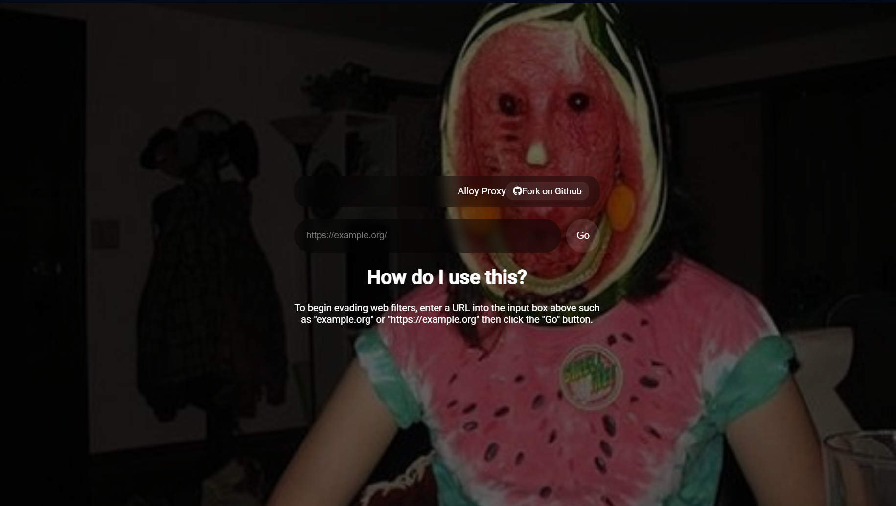

# Cursed Watermelon Lady Proxy 🍉👻


---

A **modern, floating UI web proxy** with a cursed watermelon theme. Designed to help bypass web filters while keeping a spooky and fun aesthetic.  

---

## Screenshot

<p align="center">
  
</p>

---

## Deploying to a Service

Click one of the buttons below to deploy your own instance:

[](https://heroku.com/deploy/?template=https://github.com/tropical-express/Cursed-Watermelon-Lady-Proxy)

[](https://replit.com/github/tropical-express/Cursed-Watermelon-Lady-Proxy)

[](https://glitch.com/edit/#!/import/github/tropical-express/Cursed-Watermelon-Lady-Proxy)

[](https://console.aws.amazon.com/amplify/home#/deploy?repo=https://github.com/tropical-express/Cursed-Watermelon-Lady-Proxy)

[](https://deploy.cloud.run/?git_repo=https://github.com/tropical-express/Cursed-Watermelon-Lady-Proxy)

[](https://cloud.oracle.com/resourcemanager/stacks/create?zipUrl=https://github.com/tropical-express/Cursed-Watermelon-Lady-Proxy/archive/refs/heads/main.zip)

[](https://railway.app/new/template?template=https://github.com/tropical-express/Cursed-Watermelon-Lady-Proxy)

[](https://vercel.com/new/clone?repository-url=https://github.com/tropical-express/Cursed-Watermelon-Lady-Proxy)

[](https://app.netlify.com/start/deploy?repository=https://github.com/tropical-express/Cursed-Watermelon-Lady-Proxy)

[](https://app.koyeb.com/deploy?type=git&repository=github.com/tropical-express/Cursed-Watermelon-Lady-Proxy&branch=main&name=cursed-watermelon-lady)

[](https://render.com/deploy?repo=https://github.com/tropical-express/Cursed-Watermelon-Lady-Proxy)

---

## Running Locally

```sh
git clone https://github.com/tropical-express/Cursed-Watermelon-Lady-Proxy.git
cd Cursed-Watermelon-Lady-Proxy
node server.js
